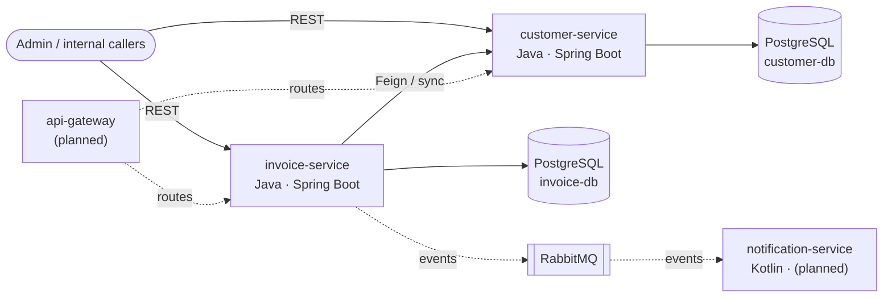

# billing-platform


Welcome dear reader!

This is a billing / invoicing backoffice built as a small **microservice landscape** with
Java and Spring Boot. It is a portfolio project focused on clean, production-like
backend practices: database-per-service, versioned schema migrations, a solid test
pyramid, containerized infrastructure and CI.

> Backoffice system (internal/admin API), not a customer-facing shop.

## Architecture



Solid lines are implemented; dashed lines/nodes are planned (see [Roadmap](#roadmap)).

## Tech stack

Java 17 · Spring Boot 3.3 · Spring Data JPA / Hibernate · PostgreSQL · Flyway ·
H2 (dev/tests) · Bean Validation · springdoc / OpenAPI · JUnit 5 · Mockito ·
Testcontainers · Docker · GitHub Actions.

## Services

### customer-service

Manages customer master data. Customers are addressed by their business key
`customerNumber` (e.g. `C-00001`); the internal database id is never exposed.

| Method   | Path                          | Description                          |
|----------|-------------------------------|--------------------------------------|
| `POST`   | `/customers`                  | Create a customer (`201` + Location) |
| `GET`    | `/customers/{customerNumber}` | Get a single customer                |
| `GET`    | `/customers`                  | List all customers                   |
| `GET`    | `/customers/active`           | List only active customers           |
| `PUT`    | `/customers/{customerNumber}` | Update a customer                    |
| `DELETE` | `/customers/{customerNumber}` | Deactivate (soft delete, `204`)      |

Errors are returned as RFC 7807 `application/problem+json` (e.g. `404` unknown
customer, `409` duplicate email, `400` validation errors).

### invoice-service

Manages invoices with line items. On creation it calls the customer-service (via
Feign) to validate the customer, and it keeps its total in sync with its items.
Addressed by the business key `invoiceNumber` (e.g. `INV-00001`).

| Method | Path                              | Description                               |
|--------|-----------------------------------|-------------------------------------------|
| `POST` | `/invoices`                       | Create a DRAFT invoice (`201` + Location) |
| `POST` | `/invoices/{invoiceNumber}/issue` | Issue an invoice (`DRAFT` → `ISSUED`)     |
| `GET`  | `/invoices/{invoiceNumber}`       | Get a single invoice                      |
| `GET`  | `/invoices`                       | List all invoices                         |

Errors as `problem+json` too (e.g. `422` unknown/inactive customer, `409` invalid
status transition, `503` customer-service unavailable).

## Getting started

**Prerequisites:** JDK 17 and Docker (only needed for the PostgreSQL profile).
The Maven Wrapper (`./mvnw`) is included — no local Maven install required.

### Run on H2 (default, no Docker)

```bash
cd customer-service
./mvnw spring-boot:run
```

- API docs (Swagger UI): http://localhost:8081/swagger-ui.html
- H2 console: http://localhost:8081/h2-console

### Run on PostgreSQL

```bash
docker compose up -d          # from the repo root: starts the PostgreSQL containers
cd customer-service
./mvnw spring-boot:run -Dspring-boot.run.profiles=postgres
```

On the `postgres` profile, Flyway applies the migrations and Hibernate runs with
`ddl-auto=validate`.

### Run the tests

```bash
cd customer-service
./mvnw test
```

## Testing

A layered test pyramid:

- **Context smoke test** — the Spring context starts.
- **Service tests** (`@SpringBootTest`, H2) — business logic, customer-number
  sequence, JPA dirty checking.
- **Web tests** (`@WebMvcTest` + `MockMvc`, service mocked) — status codes, JSON,
  validation and the `@RestControllerAdvice` error mapping.
- **Integration test** (Testcontainers + real PostgreSQL) — Flyway migration,
  `validate` and persistence against the production engine.

> The Testcontainers test skips on a Windows host where Docker Desktop's default
> socket is not exposed; it runs in CI (Linux) and from a WSL shell.

## Project structure

```text
billing-platform/
├── customer-service/            # Customer master-data microservice
│   ├── src/main/java/...        # domain, repository, service, mapper, web, exception
│   ├── src/main/resources/      # application[-postgres].yml, db/migration (Flyway)
│   └── src/test/java/...        # service, web (@WebMvcTest), Testcontainers IT
├── invoice-service/             # Invoicing microservice (calls customer-service via Feign)
├── docs/adr/                    # Architecture Decision Records
├── docker-compose.yml           # local infrastructure (PostgreSQL)
└── .github/workflows/ci.yml     # CI: build + tests on every push and PR
```

## Architecture decisions

Key decisions are recorded as ADRs:

- [ADR-0001 — Monorepo](docs/adr/0001-monorepo.md)
- [ADR-0002 — Database-per-service](docs/adr/0002-database-per-service.md)
- [ADR-0003 — Server-generated customer numbers](docs/adr/0003-server-generated-customer-numbers.md)
- [ADR-0004 — Flyway for PostgreSQL, Hibernate for H2](docs/adr/0004-flyway-for-postgres-only.md)

## Roadmap

- **notification-service** (Kotlin) — reacts to `InvoiceIssued` events over
  **RabbitMQ** (asynchronous).
- **api-gateway** (Spring Cloud Gateway) — single entry point.
- **Security** — JWT authentication/authorization at the gateway.
- **Observability** — metrics and structured logging.
