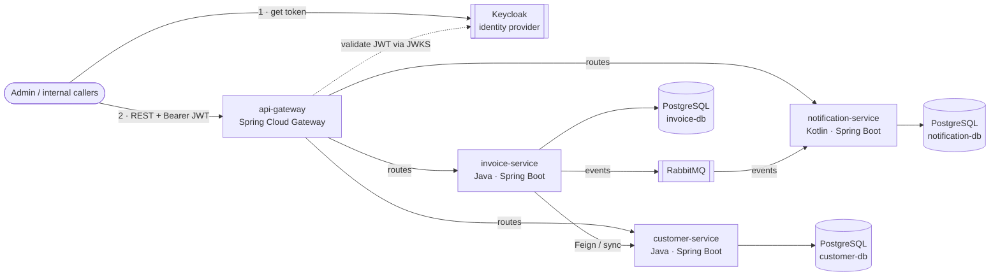

# billing-platform


Welcome dear reader!

This is a billing / invoicing backoffice built as a small **microservice landscape** with
Java and Spring Boot. It is a portfolio project focused on clean, production-like
backend practices: database-per-service, versioned schema migrations, a solid test
pyramid, containerized infrastructure and CI.

> Backoffice system (internal/admin API), not a customer-facing shop.

## Architecture


```mermaid
flowchart LR
    admin([Admin / internal callers])
    kc[["Keycloak<br/>identity provider"]]

    admin -->|1 · get token| kc
    admin -->|2 · REST + Bearer JWT| gw["api-gateway<br/>Spring Cloud Gateway"]
    gw -.->|validate JWT via JWKS| kc

    gw -->|routes| cs["customer-service<br/>Java · Spring Boot"]
    gw -->|routes| inv["invoice-service<br/>Java · Spring Boot"]
    gw -->|routes| notif["notification-service<br/>Kotlin · Spring Boot"]

    cs --> csdb[("PostgreSQL<br/>customer-db")]
    inv --> invdb[("PostgreSQL<br/>invoice-db")]
    notif --> notifdb[("PostgreSQL<br/>notification-db")]

    inv -->|Feign / sync| cs
    inv -->|events| mq[["RabbitMQ"]]
    mq -->|events| notif
```

Callers authenticate at Keycloak, then reach every service through the gateway with a
Bearer token. Solid lines are the request/event flow; the dashed line is the gateway
validating tokens against Keycloak's public keys (out of band, not a proxied call).

## Tech stack

Java 17 · **Kotlin** · Spring Boot 3.3 · Spring Data JPA / Hibernate · PostgreSQL ·
Flyway · H2 (dev/tests) · **RabbitMQ** (Spring AMQP) · Spring Cloud OpenFeign ·
**Spring Cloud Gateway** (reactive/WebFlux) · **Spring Security / OAuth2 resource
server** · **Keycloak** (OAuth2 / OIDC) · Bean Validation · springdoc / OpenAPI ·
JUnit 5 · Mockito · Awaitility · Testcontainers · Docker · GitHub Actions.

## Services

### api-gateway

The single entry point (port `8080`, reactive Spring Cloud Gateway). It routes to the
services by path — the path is forwarded **unchanged**, so `/customers/**` →
customer-service, `/invoices/**` → invoice-service, `/notifications/**` →
notification-service. Target addresses are externalized, so they can point at container
names instead of `localhost` under docker-compose.

It is also an **OAuth2 resource server**: every request needs a valid Keycloak-issued
`Bearer` JWT, or it is rejected with `401` before any proxying — only
`/actuator/health` stays public. The gateway issues no tokens itself; it just verifies
signatures against Keycloak's public keys (see
[ADR-0008](docs/adr/0008-keycloak-as-identity-provider.md) and
[ADR-0009](docs/adr/0009-jwk-set-uri-over-issuer-uri.md)).

The service endpoints below are reachable directly during local development, or through
the gateway (same paths) once security is in play.

### customer-service

Manages customer master data. Customers are addressed by their business key
`customerNumber` (e.g. `C-00001`); the internal database id is never exposed.

| Method   | Path                          | Description                          |
|----------|-------------------------------|--------------------------------------|
| `POST`   | `/customers`                  | Create a customer (`201` + Location) |
| `GET`    | `/customers/{customerNumber}` | Get a single customer                |
| `GET`    | `/customers`                  | List all customers                   |
| `GET`    | `/customers/active`           | List only active customers           |
| `PUT`    | `/customers/{customerNumber}` | Update a customer                    |
| `DELETE` | `/customers/{customerNumber}` | Deactivate (soft delete, `204`)      |

Errors are returned as RFC 7807 `application/problem+json` (e.g. `404` unknown
customer, `409` duplicate email, `400` validation errors).

### invoice-service

Manages invoices with line items. On creation it calls the customer-service (via
Feign) to validate the customer, and it keeps its total in sync with its items.
Addressed by the business key `invoiceNumber` (e.g. `INV-00001`).

| Method | Path                              | Description                               |
|--------|-----------------------------------|-------------------------------------------|
| `POST` | `/invoices`                       | Create a DRAFT invoice (`201` + Location) |
| `POST` | `/invoices/{invoiceNumber}/issue` | Issue an invoice (`DRAFT` → `ISSUED`)     |
| `GET`  | `/invoices/{invoiceNumber}`       | Get a single invoice                      |
| `GET`  | `/invoices`                       | List all invoices                         |

Errors as `problem+json` too (e.g. `422` unknown/inactive customer, `409` invalid
status transition, `503` customer-service unavailable).

On `issue()` the invoice-service also **publishes an `InvoiceIssued` event** to
RabbitMQ (see [ADR-0005](docs/adr/0005-async-events-for-notifications.md)).

### notification-service

Written in **Kotlin**. It consumes `InvoiceIssued` events from RabbitMQ
(asynchronously — it is not on the invoice's critical path) and records a
notification per event. Delivery is at-least-once, so the consumer is **idempotent**,
keyed on the event's `eventId` (see
[ADR-0006](docs/adr/0006-idempotent-consumer.md)).

| Method | Path             | Description                             |
|--------|------------------|-----------------------------------------|
| `GET`  | `/notifications` | List recorded notifications (newest first) |

## Getting started

**Prerequisites:** JDK 17 and Docker (only needed for the PostgreSQL profile).
The Maven Wrapper (`./mvnw`) is included — no local Maven install required.

### Run on H2 (default, no Docker)

```bash
cd customer-service
./mvnw spring-boot:run
```

- API docs (Swagger UI): http://localhost:8081/swagger-ui.html
- H2 console: http://localhost:8081/h2-console

### Run on PostgreSQL

```bash
docker compose up -d          # from the repo root: PostgreSQL databases + RabbitMQ + Keycloak
cd customer-service
./mvnw spring-boot:run -Dspring-boot.run.profiles=postgres
```

On the `postgres` profile, Flyway applies the migrations and Hibernate runs with
`ddl-auto=validate`.

The notification-service is event-driven: start it (it consumes from RabbitMQ), then
issue an invoice in the invoice-service and watch a notification appear at
`GET http://localhost:8083/notifications`. The RabbitMQ management UI is at
http://localhost:15672 (user `billing` / `billing`).

### Call through the secured gateway

`docker compose up -d` also starts **Keycloak** (http://localhost:8090, admin
`admin` / `admin`), which imports the `billing` realm from `keycloak/realm-billing.json`
on startup. Start the gateway (`cd api-gateway && ./mvnw spring-boot:run`) plus the
services, then go through the gateway on port `8080` with a token:

```bash
# 1. get a token from Keycloak (test user demo / demo)
TOKEN=$(curl -s -d grant_type=password -d client_id=billing-gateway \
  -d username=demo -d password=demo \
  http://localhost:8090/realms/billing/protocol/openid-connect/token | jq -r .access_token)

# 2. without a token the gateway rejects the request
curl -i http://localhost:8080/customers                       # -> 401 Unauthorized

# 3. with the token it routes through to the service
curl -H "Authorization: Bearer $TOKEN" http://localhost:8080/customers
```

### Run the tests

```bash
cd customer-service
./mvnw test
```

## Testing

A layered test pyramid:

- **Context smoke test** — the Spring context starts.
- **Service tests** (`@SpringBootTest`, H2) — business logic, customer-number
  sequence, JPA dirty checking.
- **Web tests** (`@WebMvcTest` + `MockMvc`, service mocked) — status codes, JSON,
  validation and the `@RestControllerAdvice` error mapping.
- **Integration test** (Testcontainers + real PostgreSQL) — Flyway migration,
  `validate` and persistence against the production engine.
- **End-to-end async test** (notification-service) — Testcontainers spins up **both**
  a real PostgreSQL and a real RabbitMQ; a published event flows through the broker,
  the `@RabbitListener` consumes it and a row is recorded. Awaitility handles the
  asynchronous wait, and a duplicate delivery is asserted to be recorded only once.
- **Gateway security tests** (`WebTestClient`) — assert the resource-server rules:
  unauthenticated requests get `401`, `/actuator/health` stays public, and an
  authenticated caller (`mockJwt()`) is let through. They run fully offline — no
  Keycloak, no downstream services.

> The Testcontainers tests skip on a Windows host where Docker Desktop's default
> socket is not exposed; they run in CI (Linux) and from a WSL shell.

## Project structure

```text
billing-platform/
├── customer-service/            # Customer master-data microservice
│   ├── src/main/java/...        # domain, repository, service, mapper, web, exception
│   ├── src/main/resources/      # application[-postgres].yml, db/migration (Flyway)
│   └── src/test/java/...        # service, web (@WebMvcTest), Testcontainers IT
├── invoice-service/             # Invoicing microservice (calls customer-service via Feign)
├── notification-service/        # Kotlin; consumes InvoiceIssued events over RabbitMQ
├── api-gateway/                 # Spring Cloud Gateway: single entry point, routing + JWT
├── keycloak/                    # realm-billing.json: realm/client/user as code (dev)
├── docs/adr/                    # Architecture Decision Records
├── docker-compose.yml           # local infrastructure (PostgreSQL + RabbitMQ + Keycloak)
└── .github/workflows/ci.yml     # CI: build + tests on every push and PR
```

## Architecture decisions

Key decisions are recorded as ADRs:

- [ADR-0001 — Monorepo](docs/adr/0001-monorepo.md)
- [ADR-0002 — Database-per-service](docs/adr/0002-database-per-service.md)
- [ADR-0003 — Server-generated customer numbers](docs/adr/0003-server-generated-customer-numbers.md)
- [ADR-0004 — Flyway for PostgreSQL, Hibernate for H2](docs/adr/0004-flyway-for-postgres-only.md)
- [ADR-0005 — Asynchronous events for notifications](docs/adr/0005-async-events-for-notifications.md)
- [ADR-0006 — Idempotent consumer](docs/adr/0006-idempotent-consumer.md)
- [ADR-0007 — Kotlin for the notification-service](docs/adr/0007-kotlin-for-notification-service.md)
- [ADR-0008 — Keycloak as identity provider, gateway as OAuth2 resource server](docs/adr/0008-keycloak-as-identity-provider.md)
- [ADR-0009 — jwk-set-uri instead of issuer-uri](docs/adr/0009-jwk-set-uri-over-issuer-uri.md)

## Roadmap

- **Role-based authorization** — map Keycloak roles from the token to endpoint
  permissions (the gateway does authentication today, not yet authorization).
- **Observability** — metrics and structured logging.
- **order-service** — an order that triggers billing, as a later extension.
